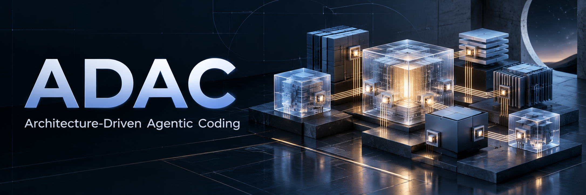
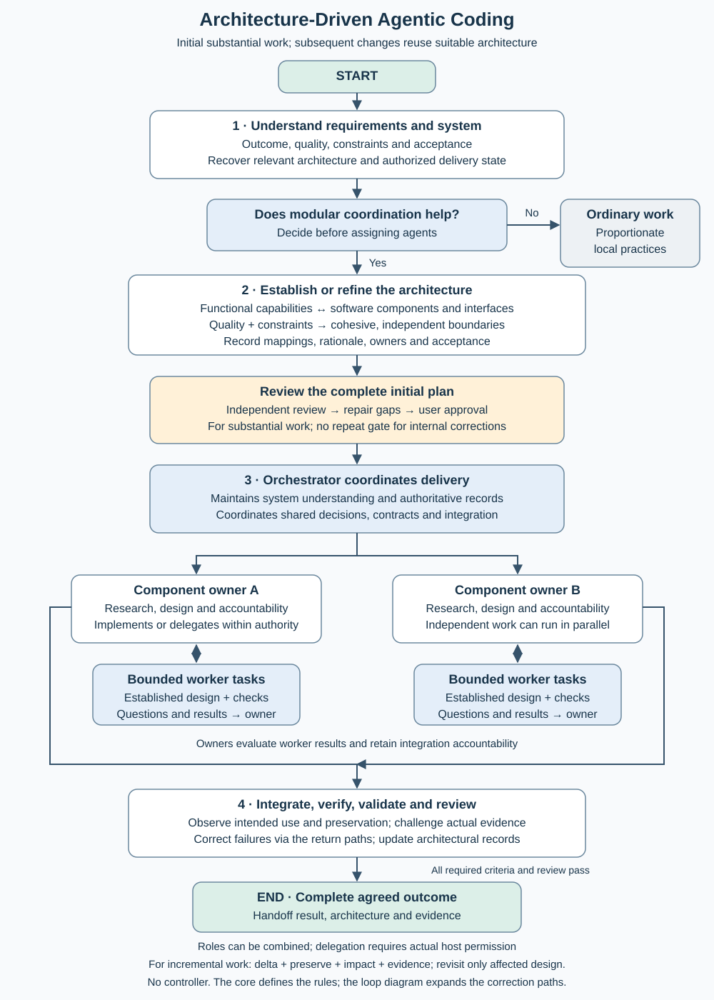

# Architecture-Driven Agentic Coding

**Use architecture to build better software, develop independent parts in parallel, and complete agreed work autonomously.**

ADAC is a lightweight, text-only method for coding agents. It connects requirements to functional responsibilities, software components and explicit interfaces, then assigns accountable owners and coordinates delivery. The architecture remains a working reference as the software evolves.

**Version:** this branch contains development candidate **2.4.0-dev.3**, with capability recommendations 1.4.0. [Main](https://github.com/amfi75/architecture-driven-agentic-coding/tree/main) identifies the latest stable release, currently **2.3.0**. Existing projects retain their recorded revision; discovering a newer version does not activate it.

## Why ADAC?

1. **Maintainable, adaptable software of high quality.** Cohesive responsibilities, hidden implementation decisions and meaningful interfaces limit coupling and localize change. Appropriate abstractions support reuse without speculative generality.
2. **Faster implementation through controlled parallel work.** Architecture creates sufficiently independent components or groups. Owners develop them concurrently once shared decisions and contracts are ready; the orchestrator coordinates integration.
3. **Autonomous completion of the agreed outcome.** Agents research, implement, evaluate and correct. Internal design changes remain autonomous; changes to agreed requirements or protected commitments return to the user.

The method requires no controller, interpreter, installer, provider or particular harness. Its conventions are readable, versionable project text. Agents must follow them; the text does not enforce compliance. The maintainer reports about six months of successful use, including faster implementation than single-agent work; this is practitioner experience, not a quantified comparative study.

## When does it help?

Use ADAC when meaningful responsibilities and interfaces can support coordinated development—for example, communication, application behavior, storage and user interaction. These are examples, not mandatory layers or services. A modular monolith can qualify. Small local fixes and inseparable tasks usually need ordinary proportionate practices.

For new software, understand requirements before establishing architecture. For an improvement, recover the relevant system understanding, identify the intended change and behavior to preserve, and retain suitable architecture. A change can fit existing boundaries while still having substantial regression risk. Both use the same correction loop; an improvement does not automatically restart architectural planning or user approval.

## How it works

**Requirements → functional architecture → software architecture and interfaces → accountable work → integrated evidence.** Functional and software views are connected, not a one-function-per-component rule. Quality and constraints also shape software boundaries.

| Role | Responsibility |
| --- | --- |
| Orchestrator | System understanding, architecture, cross-component decisions, coordination and the complete result. |
| Component owner | Research, design, delivery and integration accountability for a component or coherent group. |
| Worker | A bounded implementation task against established requirements and design; unresolved design questions return to its owner. |
| Independent reviewer | Read-only challenge of the plan and evidence against the agreement. |

An owner can implement directly; the orchestrator can also own components. Roles do not require separate agents. Demanding research and design need suitable reasoning capability; well-defined implementation can use lighter models. [Capability advice](releases/2.4.0-dev.3/recommendations.md) explains this division without prescribing a router or granting permissions.

Implementation problems return to implementation; owner-level questions return to the owner; shared-interface or architectural problems return to the orchestrator. Necessary changes to protected commitments return to the user. The [loop guide](docs/agent-loop.md) shows those paths and the initial/final review gates.

## Start with your agent

Give the agent this request:

> Use ADAC from https://github.com/amfi75/architecture-driven-agentic-coding for this task: [describe the task]. Honor the project's existing ADAC pin; otherwise use the latest stable release identified on main. Resolve it to one exact commit and read its SETUP.md and core. Assess suitability and, when ADAC applies, establish the project records and follow the method for the complete task.

To try this branch, explicitly add: **“Use development candidate 2.4.0-dev.3 from branch `adac-2.4-system-understanding`; if the project is pinned, first propose its migration.”** Candidate selection does not silently override an existing project pin.

The agent follows [setup](SETUP.md). You do not need to select templates, run a command or install a skill. The method can be read directly from the repository; copying it remains useful for offline use or customization.

When applying this candidate, the agent establishes these project records, reusing existing equivalents:

| Record | Purpose |
| --- | --- |
| `AGENTS.md` | Entry point with exact ADAC revision and authoritative record locations. |
| `ARCHITECTURE.md` | Functional and software architecture, their mapping, interfaces and rationale. |
| `DELIVERY.md` | Agreed requirements and approval history, clearly separated from evolving assignments, progress and evidence. |

These records describe your project; they are not copies of ADAC. They let agents resume relevant work after context loss and help detect architectural drift. Owners update them during delivery. Success means the complete agreed result works in its intended use, relevant existing behavior remains intact, and the records agree with the verified software.

## Updates and further reading

**Checking for a newer release and migrating are different actions.** An upgrade compares versions and local adaptations, reconciles roles and records, preserves approved commitments, coordinates active agents and only then switches the pin. See [migration and rollback](docs/versioning-and-migration.md).

- [Core](releases/2.4.0-dev.3/core.md): complete shared requirements.
- [Concept](method/concept.md) and [method index](method/README.md): explanation and task-triggered guidance.
- [Candidate notes](releases/2.4.0-dev.3/README.md): changes and migration from earlier versions.
- [Architecture foundations](docs/architecture-foundations.md) and [design rationale](docs/design-rationale.md): established theory, ADAC's application and human/AI contribution.
- [Verification and experience](docs/verification.md): what was actually checked and what was not.

Previous [dev.2](releases/2.4.0-dev.2/README.md), [dev.1](releases/2.4.0-dev.1/README.md) and [2.3.0](releases/2.3.0/README.md) snapshots remain unchanged. Private project implementations and their evidence are excluded.

[MIT license](LICENSE) · [Provenance](NOTICE.md) · [Contributing](CONTRIBUTING.md) · [Maintainer checks](docs/maintaining.md)
