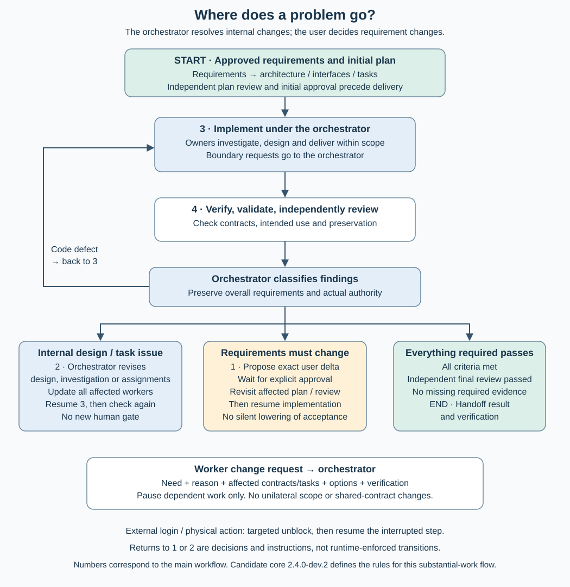

# The delivery loop within architecture-driven work

The [workflow](diagrams/workflow.svg) shows the initial substantial-work path; it is not a requirement to restart planning for every improvement. The [core](../releases/2.4.0-dev.3/core.md) governs proportionate work, required gates and authority. Its section numbers differ from the diagram's four stages.

1. **Understand:** requirements and relevant current system/records.
2. **Establish or refine architecture:** functional capabilities, software components, interfaces, ownership and work. Initial substantial work receives independent plan review and user approval.
3. **Deliver:** the orchestrator coordinates component owners; owners can implement directly or delegate bounded tasks. Independent contributions can proceed in parallel after shared decisions are ready.
4. **Evaluate:** integrate, verify contracts, validate intended use and obtain required independent review. Completion requires the whole agreed outcome and relevant preservation.

## Route each finding

| Finding | Recipient and return | User decision? |
| --- | --- | --- |
| Implementation defect or missing change/preservation evidence | Worker/owner corrects the task, then repeats affected checks (3 → 4). | No |
| New dependency, invariant or effect | Expand relevant understanding and impact/preservation/evidence (1), then continue affected delivery. | No, within the agreement |
| Worker encounters an invalid design or insufficient scope | Component owner investigates and resolves within its discretion (2 → 3). | No |
| Shared interface, neighboring-component or architectural boundary needs change | Owner sends the orchestrator reasons, affected tasks/consumers, options and checks; coordinate revised architecture/contracts (2 → 3). | No, if protected commitments remain intact |
| Repeated broad impact or preservation failures | Reconsider whether architecture localizes change (2); no automatic refactor. | Only if required commitments must change |
| Required outcome or binding constraint must change | Orchestrator proposes an exact delta (1); obtain approval, revise affected planning/review, then resume. | Yes, before relying on it |
| Login/access or physical action only the user can supply | Request the targeted unblock and resume the interrupted step. | Bounded action, not a new planning cycle |
| All required criteria and applicable review pass | Handoff the verified result and consistent architecture/delivery records. | END |

Pause affected work only; unrelated authorized work continues. Before dependent work resumes, update authoritative records and communicate the same decisions and contract revisions to owners and workers. A stronger model cannot widen a task or relabel a protected commitment. Independent review remains read-only.

The [change-request guide](../method/change-request-workflow.md) supplies the message format. These are agent instructions, not controller-enforced transitions. [Verification](verification.md) states what has actually been checked.
